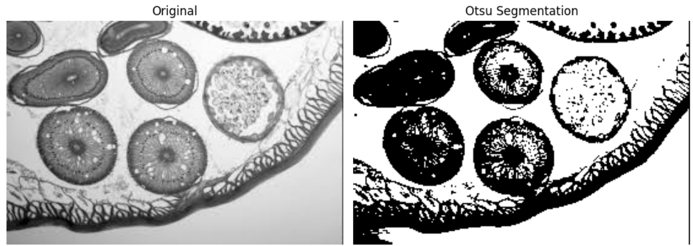

# Microscopic Image Segmentation

This project performs a simple herbaceous tissue segmentation on a microscopic image using Otsu's thresholding method.

## 📁 Project Contents

- `input.png` - The original microscopic image to be segmented.
- `output.png` - The resulting image after segmentation.
- `segment.py` - Python script that performs image processing and segmentation.

## 🧠 Method Used

- **Otsu Thresholding**: An automatic image thresholding technique that determines the optimal threshold value based on histogram analysis to separate the image into foreground and background.

## 🖼️ Sample Output

Below is the output image generated after segmentation:



## ⚙️ How to Run

```bash
python main.py
